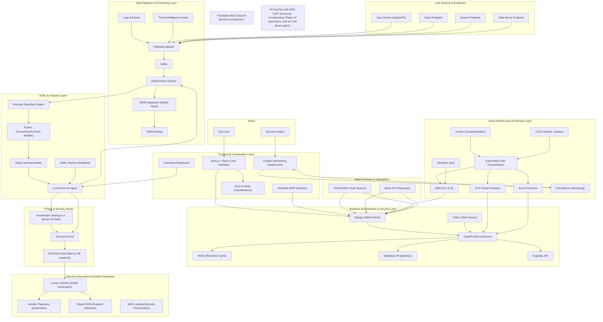

# OxSuite - Empowering Cybersecurity through Innovative Tools 🛡️✨

## 🚀 Vision

***OxSuite*** aims to revolutionize the way individuals and organizations approach cybersecurity. By integrating a suite of advanced tools, OxSuite provides users with the capabilities to analyze, assess, and enhance their security posture. Our vision is to create a user-friendly ecosystem where cybersecurity knowledge meets practical application, making it accessible to everyone, from professionals to enthusiasts.

### **Scalable Multi-Cloud AI-SecOps Architecture**

*This architecture provides a scalable, multi-cloud AI-SecOps solution that leverages AWS, GCP, and Azure to handle real-time security operations. Incorporating PTaaS, AI automation, and an LLM-driven agent, the system aims to enhance threat detection, response automation, and endpoint security.*

---

## Architecture Overview

## 🌟 Key Features

1. ***OxIntell 🧠*** - A deep dive into cybersecurity topics with a focus on secure coding principles, code analysis, and CVE information.

2. ***OxRAG 🐂*** - An advanced Retrieval-Augmented Generation (RAG) tool that extracts and analyzes text from various file types, enhancing information retrieval with the Gemini LLM.

3. ***OxImaGen 🖼️*** - A creative AI tool that generates high-quality images and storytelling content, integrating user-defined parameters for tailored outputs.

4. ***OxScanner🔎***- A powerful cybersecurity tool for network security analysis, offering functionalities like network scanning, packet sniffing, and attack simulations.

---

## 🌐 MVP Experience

The OxSuite MVP is live and available for exploration! You can experience the tools and functionalities firsthand at OxSuite Website. Here’s what you can expect:

**Interactive Interface**: Navigate through the suite effortlessly, with a design focused on user experience.

**Real-Time Functionality**: Test the capabilities of each tool and see how they can enhance your cybersecurity efforts.

**Feedback Loop**: We value your input! Your experiences and suggestions will help shape the future of OxSuite.

---

## 🚧 Challenges Addressed

OxSuite addresses key challenges in cybersecurity:

**Complexity of Tools**: Many existing tools are cumbersome and require extensive training. OxSuite aims to simplify this with an intuitive interface.

**Integration of Resources**: Combining multiple cybersecurity functionalities into one suite ensures that users have everything they need in one place.

**Keeping Up with Threats**: Continuous updates and enhancements are crucial in keeping pace with evolving cyber threats. OxSuite is built with adaptability in mind.

---

## 🔧 Technology Stack

***OxSuite*** is built on a robust architecture that leverages the latest technologies:

1. ***Programming Languages***:

**Python**: The backbone of all functionalities, ensuring reliability and scalability.

**JavaScript & HTML**: For dynamic web interaction and design.

2. ***Frameworks***:

**Streamlit**: Provides an interactive platform for deploying machine learning and AI tools.

**LangChain**: Facilitates the integration of LLM functionalities.

3.***APIs and Models***:

**Gemini API**: For advanced language processing capabilities.

**Hugging Face**: For leveraging various machine learning models.

---

## 💼 Real-World Applications

***OxSuite*** can be utilized in a variety of settings:

**Corporate Security Teams**: Use OxSuite to assess vulnerabilities and implement security measures effectively.

**Educational Institutions**: Integrate into cybersecurity courses to provide students with hands-on experience using advanced tools.

**Freelance Security Consultants**: Empower clients with comprehensive analysis and reporting tools.

---

## 💡 Future Enhancements

We are committed to continuous improvement and innovation. Future updates to OxSuite may include:

***Enhanced Machine Learning Features 🤖***: Integrating predictive analytics to forecast potential security threats.

***Community Engagement 👥***: Building forums and collaborative spaces for users to share insights and experiences.

***Additional Tool Integrations 🔗***: Expanding the suite with more functionalities based on user feedback and market demands.

---

## 🌈 Join the Movement!

Experience the cutting-edge of cybersecurity with OxSuite. Visit our live MVP at OxSuite Website and explore the possibilities. We welcome your feedback and ideas to help us grow and evolve this innovative platform!

---
